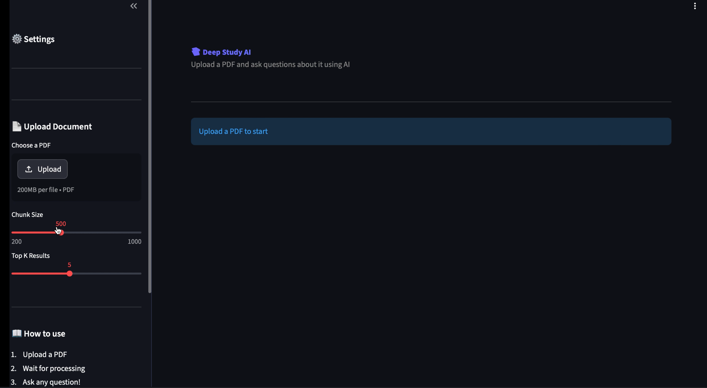
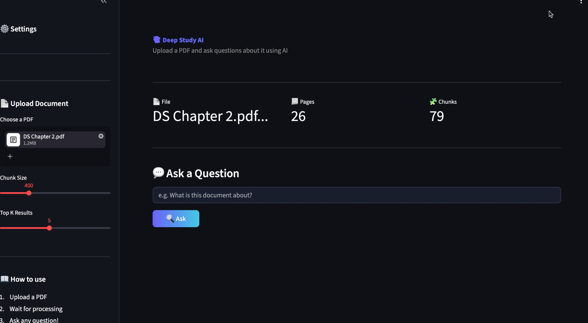
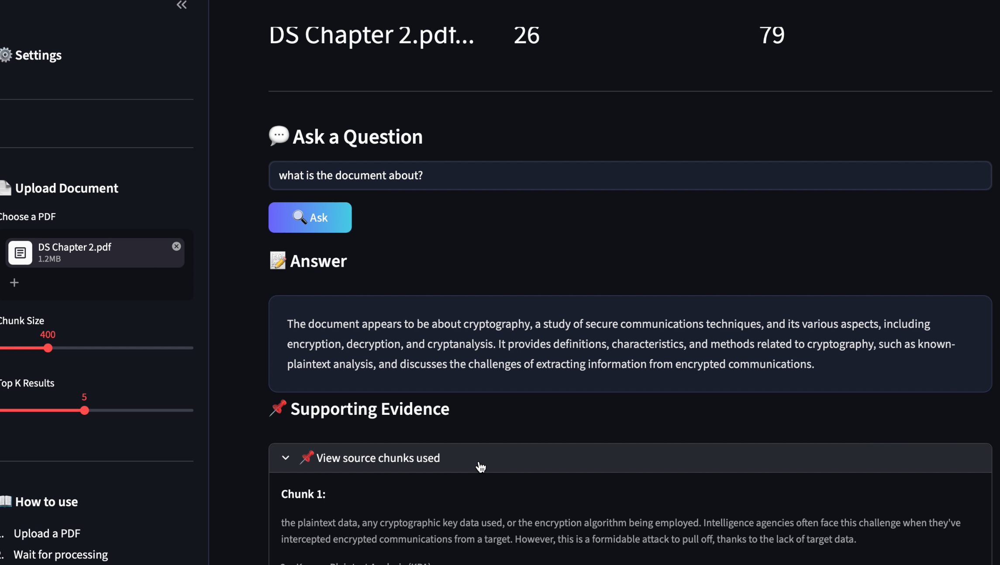

# 📚 Deep Study AI

An AI-powered document assistant that allows users to upload PDFs and ask questions based on the content using Retrieval-Augmented Generation (RAG).

---

## 🚀 Features

- 📄 Upload PDF documents  
- 🤖 Ask questions from document content  
- 📌 Evidence-based answers (grounded responses)  
- ⚙️ Adjustable chunk size  
- 🔍 Top-K semantic retrieval  
- 🚫 Daily usage limit per user  

---

## 🛠 Tech Stack

- Streamlit  
- LangChain  
- FAISS  
- HuggingFace Embeddings  
- Groq API  

---

## 📸 Demo

### Upload & Processing


### Answer + Evidence


### Source Chunks


---

## ⚠️ Note

- This app uses external AI APIs to process documents  
- API key is secured using environment variables  

---

## ▶️ Run Locally

```bash
pip install -r requirements.txt
streamlit run app.py
